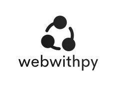

Webwithpy is a free to use fullstack web framework mainly focussed on performance and ease of use.
The goal of webwithpy is to have an easy-to-use web framework whilst still maintaining high performance.

A clear example of the use of webwithpy:
```python
from webwithpy import run_server
from webwithpy.routing import GET
from webwithpy.orm import DB, Table, Field

db = DB('databases/db.sqlite')


class User(Table):
    table_name = "user"
    name = Field("string")
    email = Field("string")
    profile_picture = Field("image")


@GET('/')
def view_users():
    # user logic goes here
    return (db.user.id >= 0).select()


if __name__ == "__main__":
    # all tables that are defined before this statement will be initialized
    db.create_tables()

    # run the server when you're done creating views and databases
    run_server()
```

## Documentation
The documentation is not fully done yet however it is something for now:
[webwithpy docs](https://webwithpy.readthedocs.io)
