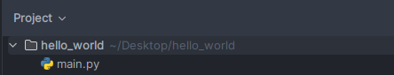
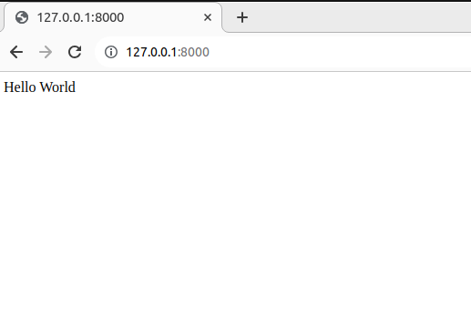

# Getting started with webwithpy

An introduction to webwithpy

---

## Installation
To install and use webwithpy you will need an installation of python(with pip) that is at least older than version v3.10
Now to install webwithpy use this cmd command:
```bash
pip install webwithpy
```
Now you have a working version of webwithpy you can get started on creating your first application.

## creating your first project
Getting started with webwithpy is really easy, first you will want to create a folder where you want the contents
of your website. For this example where going to name the folder hello_world and put a main.py file in it.

<br>Now open up the main.py file in your favorite editor and copy over this piece of code:

```python
from webwithpy import run_server
from webwithpy.routing import ANY

@ANY(url='/')
def hello_world():
    return "Hello World"

if __name__ == '__main__':
    run_server()
```
Congrats! now if you run you're python application by running this command in the folder where you have stored your 
main.py you will have created your first webpage:
```bash
python3 main.py
```
To view your webpage go to 127.0.0.1:8000 and you should see this result:
